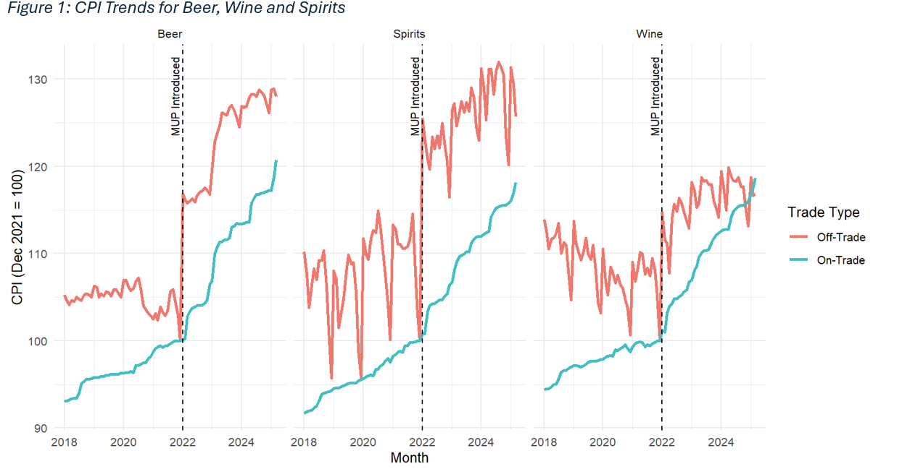
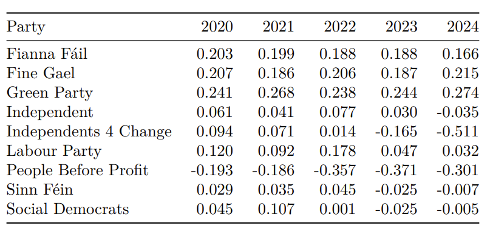
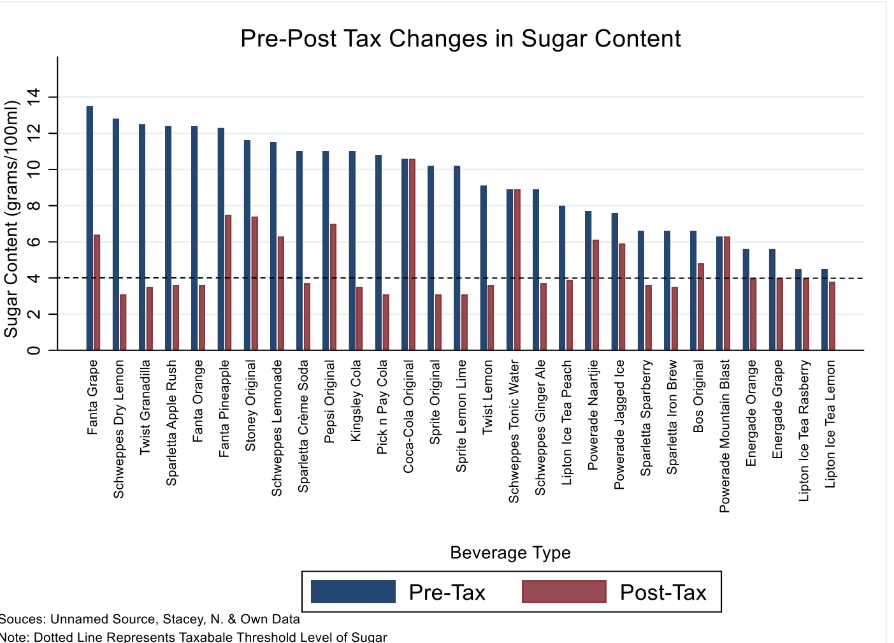

## Portfolio

---

### Reserach Papers

## Master's Dissertation
**Minimum Unit Pricing in Ireland: A Quasi-Experimental Evaluation of Alcohol Prices, Consumption and Drink-Driving Offences**  

*Submitted May 2025 - grade pending*

[Read the dissertation (PDF)](pdf/Dissertation_Final_Draft.pdf)  

---

## Quantitative Text Analysis Research Project  (Masters)
**Framing Immigration: A Comparative Sentiment Analysis of Irish Party Manifestos and Parliamentary Speeches (2020–2024)**  

*Grade: 74% (Distinction)*

[Read the project (PDF)](pdf/QTA-Final-Markdown-File-New.pdf)  

---

## Undergraduate Thesis  
**Investigating the Supply-side effects of a tax on Sugar-Sweetened Beverages in South Africa**  

*Grade: 85% (Distinction)*

[Read the thesis (PDF)](pdf/Thesis_Final.pdf)  

---

### Other Links

- [Currciulum Vitae](https://github.com/dheneck/dheneck.github.io/blob/master/pdf/New%20CV%20PDF.pdf)
- [Linkedin](https://www.linkedin.com/in/daniel-heneck-049b28113/)
- [Undergraduate Academic Record (PDF)](pdf/Academic_Record_Daniel_Heneck.pdf)

---

---

Page template forked from <a href="https://github.com/evanca/quick-portfolio">evanca</a>

<!-- Remove above link if you don't want to attibute -->
